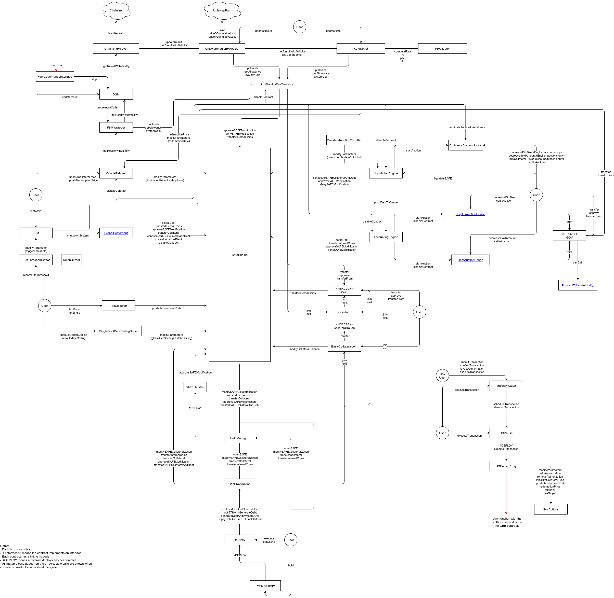

# Introduction to GEB

GEB is a framework for deploying systems that can issue [stablecoins](https://medium.com/reflexer-labs/stability-without-pegs-8c6a1cbc7fbd). Stablecoins don't look like [this](https://www.coingecko.com/en/coins/usd-coin) \(that's a pegged coin\), but rather like [this](https://duneanalytics.com/HggqX/Reflexer-RAI). Stablecoins are a great collateral source for other DeFi protocols \(compared to ETH or BTC\) or as stable assets with embedded funding rates that supercharge other DeFi protocols.  
  
This documentation is meant to explain all the components behind GEB. Before diving in the docs, we recommend reading our original [whitepaper](https://github.com/reflexer-labs/whitepapers/blob/master/English/rai-english.pdf).  
  
GEB is a modified fork of [MCD](https://github.com/makerdao/dss) that has several core differences:

* Variable names you [can actually understand](https://docs.reflexer.finance/contract-translation/naming-transition)
* An autonomous feedback mechanism that changes the incentives of system participants
* The possibility to add insurance for SAFEs
* Fixed and increasing discount auctions \(instead of English auctions\) used to sell off collateral
* Automatic adjustment of several parameters in the system
* A set of contracts that bound control over parameters that are governed in the long run
* The possibility to send stability fees at once to multiple addresses
* The possibility to switch between surplus auctions and other types of strategies meant to remove surplus from the system
* Two prices for each `CollateralType`: one used for generating debt, the other one used exclusively when liquidating SAFEs
* A stability fee treasury that can pay for oracle calls, market making or teams who onboard collateral and take care of the system

### GEB Overview Diagram

Explore the diagram in detail [here](https://viewer.diagrams.net/?target=blank&highlight=0000ff&layers=1&nav=1&title=GEB_overview.drawio#Uhttps%3A%2F%2Fdrive.google.com%2Fuc%3Fid%3D1nIcaY8N8StVCfyAL_ztbmETJX2bvY3a9%26export%3Ddownload).



