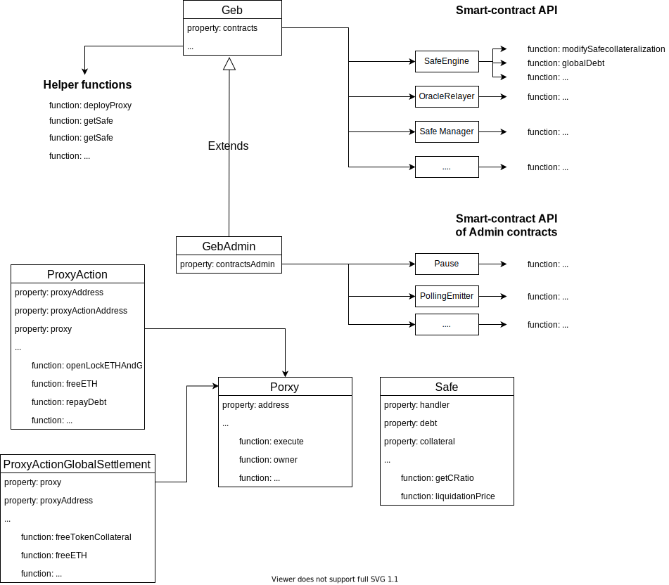

# Introduction to GEB

GEB is a framework for deploying systems that can issue [reflex index](https://medium.com/reflexer-labs/stability-without-pegs-8c6a1cbc7fbd)[es](https://medium.com/reflexer-labs/stability-without-pegs-8c6a1cbc7fbd). Reflex indexes are assets that dampen the volatility of their underlying collateral. They are useful as more "stable" collateral for other DeFi protocols \(compared to ETH or BTC\) or as tools that give their holders more time to react to the underlying's price moves.  
  
As an example, if a reflex index was backed by ETH and one day ETH would significantly drop in price, the index would delay this shock and spread it over a longer period of time. The length of the "spread" depends on how the feedback mechanism is set up and on how reflex index users react to the mechanism's incentives \(or even to the mere expectation that the mechanism will change user incentives in a certain way\).  
  
This documentation is meant to explain all the components behind GEB. Before diving in the docs, we recommend reading our original [whitepaper](https://github.com/reflexer-labs/whitepapers/blob/master/English/rai-english.pdf).  
  
GEB is a modified fork of [MCD](https://github.com/makerdao/dss) that has several core differences:

* Variable names you [can actually understand](https://docs.reflexer.finance/contract-translation/naming-transition)
* An autonomous feedback mechanism that changes the incentives of system participants
* The possibility to add insurance for SAFEs
* Fixed discount auctions \(instead of English auctions\) used to sell off collateral
* Automatic adjustment of `AccountingEngine` \(former `Vow`\) parameters
* The possibility to send stability fees at once to multiple addresses
* Two prices for each `CollateralType`: one used for generating debt, the other one used exclusively when liquidating SAFEs
* A stability fee treasury that can pay for oracle calls, market making or teams who onboard collateral and take care of the system
* A settlement surplus auctioneer that sells any remaining surplus after settlement is triggered
* An Oracle Network Medianizer that does not rely on any particular price feed and can be upgraded \(within certain bounds\) by governance
* A governance minimization layer that bounds human intervention over the system

### GEB overview diagram

[Online explorer diagram](https://viewer.diagrams.net/?target=blank&highlight=0000ff&layers=1&nav=1&title=GEB_overview.drawio#Uhttps%3A%2F%2Fdrive.google.com%2Fuc%3Fid%3D1nIcaY8N8StVCfyAL_ztbmETJX2bvY3a9%26export%3Ddownload)



