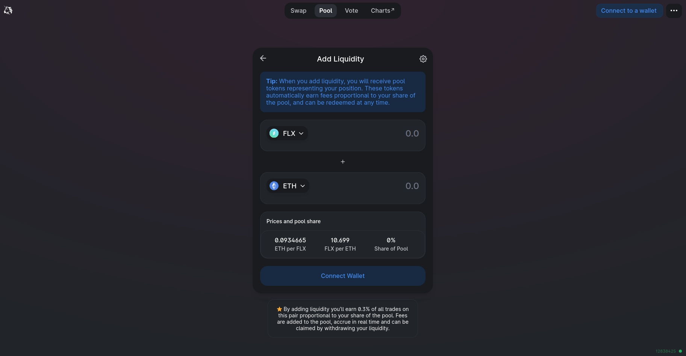
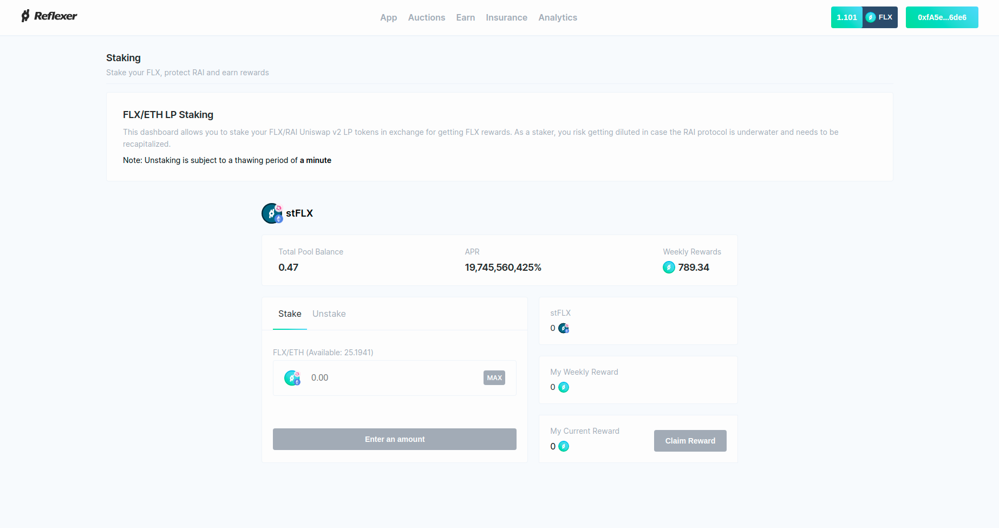
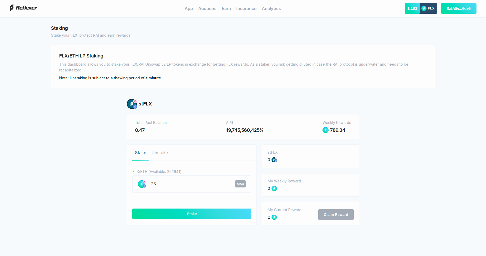
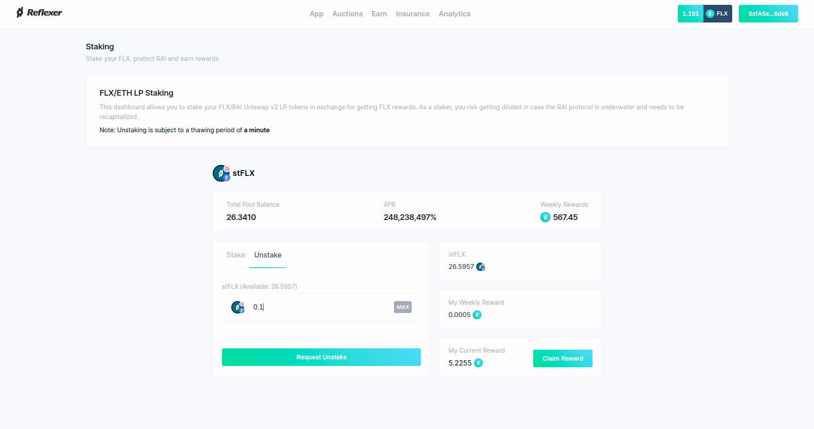
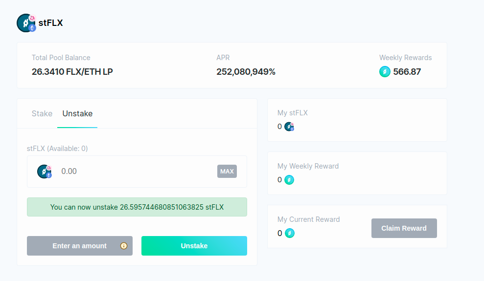

# FLX Staking

## 1. Overview

Stakers are in charge with protecting the RAI protocol from insolvency. They stake [FLX/ETH Uniswap v2 LP tokens](https://v2.info.uniswap.org/pair/0xd6f3768e62ef92a9798e5a8cedd2b78907cecef9) in a smart contract that then constantly checks whether RAI is well capitalized.

In case the protocol is undercapitalized \(has debt that is not backed by collateral\), the staking pool will start to auction FLX/ETH LP tokens in exchange for RAI that is then used to bring the protocol above water. Stakers will get diluted in this process.  
  
In exchange for protecting the protocol, stakers receive more FLX.

## 2. Staking Pool Parameters

### Mainnet

* Exit delay \(thawing period\): 21 days
* Reward unlock period: 3 months. Locked rewards are unlocked linearly during a 3 month time period from the moment a staker requests that they claim their rewards
* Percentage of rewards unlocked over 3 months: 75%
* Percentage of rewards that can be claimed right away \(no unlock\): 25%
* Percentage of LP tokens in the pool that can be slashed/auctioned: 30% \(the rest of the pool isn't auctioned/slashed\)

### Kovan

* Exit delay \(thawing period\): 1 minute
* Reward unlock period: 10 minutes. Locked rewards are unlocked linearly during a 10 minute time period from the moment a staker requests that they claim their rewards
* Percentage of rewards unlocked over 10 minutes: 75%
* Percentage of rewards that can be claimed right away \(no unlock\): 25%
* Percentage of LP tokens in the pool that can be slashed/auctioned: 30% \(the rest of the pool isn't auctioned/slashed\)

## 3. RAI Insolvency

The RAI protocol is "insolvent" when liquidations \(collateral auctions\) are not successful \(cannot repay a Safe's debt by selling ETH\) and they leave leftover RAI which is not backed by collateral anymore.

Liquidations can be unsuccessful when:

* Only a portion of RAI is received by the liquidation out of the total amount of RAI that was requested
* The value of ETH drops during a liquidation and there isn't any incentive to bid with RAI \(value of ETH is less than the value of RAI requested\)
* The market price of RAI soars more than 10% above the redemption price which makes liquidations unprofitable

If there's too much unbacked RAI in the protocol, the system becomes insolvent. In case of insolvency, stakers are the first line of defense.

Anyone can call the staking pool to auction LP tokens immediately after the protocol becomes insolvent. In Section 2 above you can see the percentage of the staking pool that can be auctioned in exchange for RAI which is subsequently used to eliminate unbacked debt.

### Determining Insolvency

RAI being "insolvent" means that there must be at least `debtAuctionBidSize` unbacked RAI on the protocol's balance sheet. The `debtAuctionBidSize` can be automatically recomputed by the protocol approximately every 4 days \(assuming that someone calls the protocol to recalculate the parameter\). The current `debtAuctionBidSize` parameter value can be read from the [accounting engine](https://etherscan.io/address/0xcee6aa1ab47d0fb0f24f51a3072ec16e20f90fce#readContract) contract.

The staking pool can read the amount of unbacked debt that the [accounting engine](https://etherscan.io/address/0xcee6aa1ab47d0fb0f24f51a3072ec16e20f90fce#readContract) has and compare it to the `debtAuctionBidSize` value. If there's more unbacked debt than `debtAuctionBidSize`, it means that the protocol is insolvent and the staking pool can start to auction tokens.

## 4. Staking Walkthrough

First, you need to provide liquidity in this [FLX/ETH Uniswap v2 pool](https://app.uniswap.org/#/add/v2/0x6243d8cea23066d098a15582d81a598b4e8391f4/ETH) for mainnet and in [this pool](https://app.uniswap.org/#/add/v2/0x6e6eA84bb2fcE17AfCE8e1117DdC708142ef51c9/ETH) for Kovan.

Once you receive your FLX/ETH LP tokens, head over [here](https://app.reflexer.finance/earn/staking) \(for mainnet\) and [here](https://app-kovan.reflexer.finance/earn/staking) \(for Kovan\) in order to see the staking dashboard.

In the Stake section, you can specify how many LP tokens you'd like to stake. 

Once you stake, you will start to accrue rewards every block. You can claim rewards anytime using the **Claim Reward** button.

When you want to start unstaking, you can head over to the **Unstaking** section.

Unstaking must be done in two stages:

* You request that a portion of your currently staked tokens should be unstaked
* You wait for the full thawing period until you can get your LP tokens back from the staking contract

**There are also several important things you must keep in mind when you unstake:**

* The amount of tokens that are waiting to be unstaked **do not** count toward accruing rewards anymore. You only accrue rewards for the tokens that are both staked and are not waiting to be unstaked
* Take the following scenario: Alice has 10 tokens staked. She requests to unstake 5 tokens and has to wait 3 weeks to withdraw them from the contract. After 2 weeks, Alice requests that she unstakes another 3 extra tokens \(so she's only earning rewards with 2 tokens now\). Alice must wait 3 weeks from the moment of the **second unstake request** in order to withdraw the whole 8 tokens from the contract
* Take another scenario: Alice has 10 tokens staked. She requests to unstake 5 tokens and has to wait 4 weeks to withdraw them from the contract. After 5 weeks, Alice does not unstake the 5 tokens but rather requests that she unstakes another 3 extra tokens \(so she's only earning rewards with 2 tokens now\). Alice must wait 4 weeks from the moment of the **second unstake request** even if the 5 tokens could have been withdrawn from the contract

Two things to keep in mind:

* After you stake, the staking pool will mint a claim token for you called **Staked FLX \(stFLX\)**. **stFLX is not transferrable**
* **You can still get slashed while you're waiting to unstake from the pool**

You will notice that the amount of stFLX you receive might differ from the amount of LP tokens you stake. That is normal behaviour.

## 5. Transition from LP Only to Staking

**NOTE**: the transition will start on 18th of August 2021 at 12:50 PM UTC.

Prior to staking, FLX holders will receive rewards for LPing in the Uniswap v2 FLX/ETH pool. Once staking starts, incentives for LPing only will progressively move to stakers only.  
  
The transition will happen as follows:

* First 2 weeks of staking: 50 FLX for stakers only, 90 FLX for FLX/ETH LPs only
* Weeks 3 and 4 of staking: 90 FLX for stakers only, 50 FLX for FLX/ETH LPs only
* From the 5th week of staking onward: 120 FLX for stakers only, no FLX for simple FLX/ETH LPs

