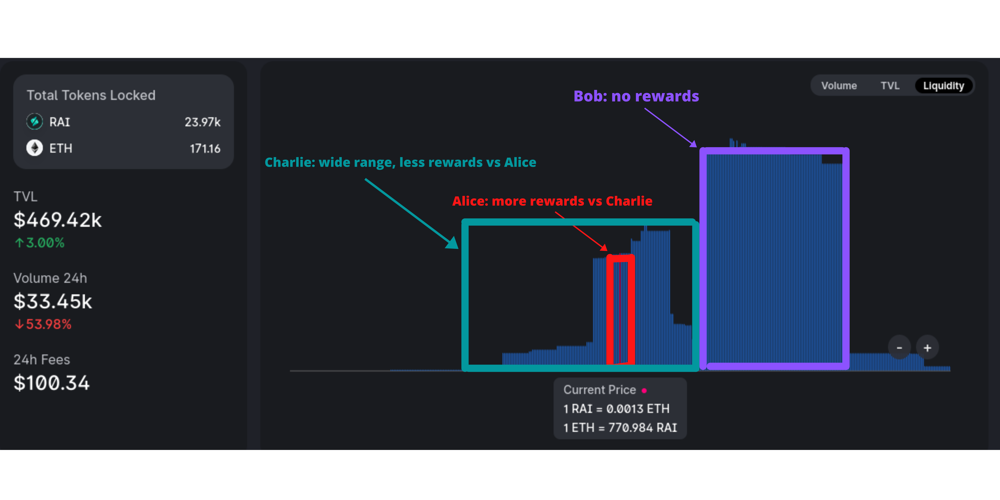

# RAI Uniswap V3 Mint + LP Incentives Program

## Overview

The RAI Mint + LP strategy requires that participants mint RAI **and** provide RAI/ETH liquidity on Uniswap v3 at the same time in order to accrue retroactive rewards.  
  
The RAI/ETH Uniswap v3 pool for this program is [here](https://info.uniswap.org/#/pools/0x14de8287adc90f0f95bf567c0707670de52e3813). **The program will demo for 2 weeks starting on 9th of July 2021 and will distribute 400 FLX for RAI/ETH LPs and another 400 FLX for RAI/DAI LPs. After the demo, we will gather results and reassess.**

## How It Works

1. Go to [app.reflexer.finance](https://app.reflexer.finance/) or [DeFi Saver](https://app.defisaver.com/reflexer/manage) and mint some RAI.
2. Go to the [RAI/ETH Uniswap v3 pool](https://info.uniswap.org/#/pools/0x14de8287adc90f0f95bf567c0707670de52e3813) or the [RAI/DAI Uniswap v3 pool](https://info.uniswap.org/#/pools/0xcb0c5d9d92f4f2f80cce7aa271a1e148c226e19d) and add the RAI you minted as liquidity

You do **not** accrue rewards if:

* You provide RAI/ETH liquidity without minting RAI \(e.g buy from the pool and LP\)
* You mint RAI without adding RAI/ETH liquidity

If you mint more RAI than the amount of RAI you provide as liquidity, you only accrue rewards on the amount you minted & LPed. Likewise, if you add more RAI as liquidity than you mint, you accrue rewards only on the RAI amount that you both minted and LPed.

## LP Strategy

The rewards will be distributed pro-rata according to how much each LP concentrates liquidity around RAI's redemption price. To visualize this, let's take the example of Alice \(red\), Bob \(purple\) and Charlie \(green\) who LP in the RAI/ETH pool.

You can see that:

* Alice accrues the most rewards because she concentrated liquidity really close to the current redemption price
* Bob is not accruing any rewards because none of his liquidity is concentrated around the current redemption price
* Charlie is accruing some rewards but less than Alice because he has a wider liquidity distribution around the redemption price

To maximize rewards, LPs have to concentrate liquidity closer to the redemption price \(**at the risk of higher impermanent loss**\). To get the current RAI redemption price, you can visit our [stats page](https://stats.reflexer.finance/).

