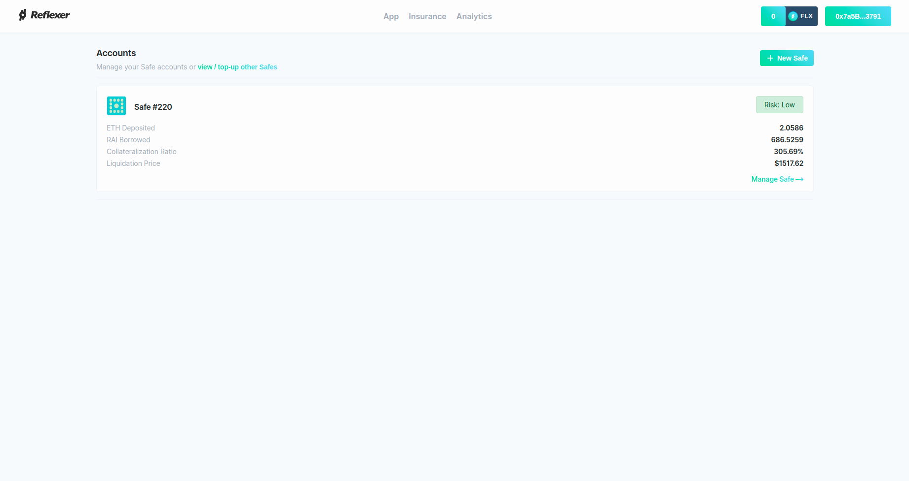
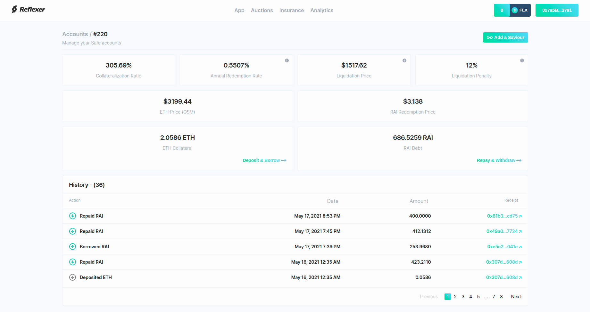
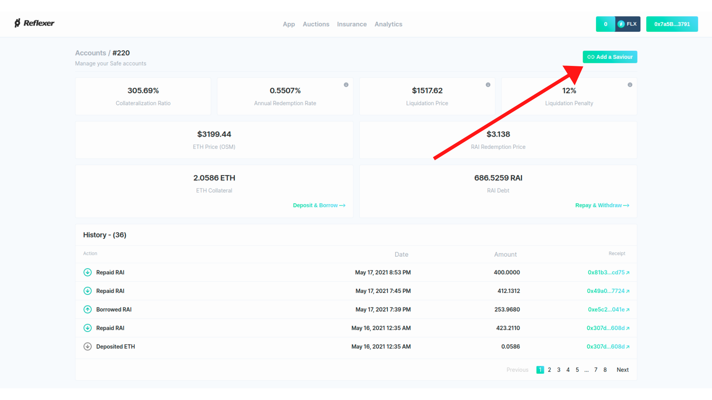
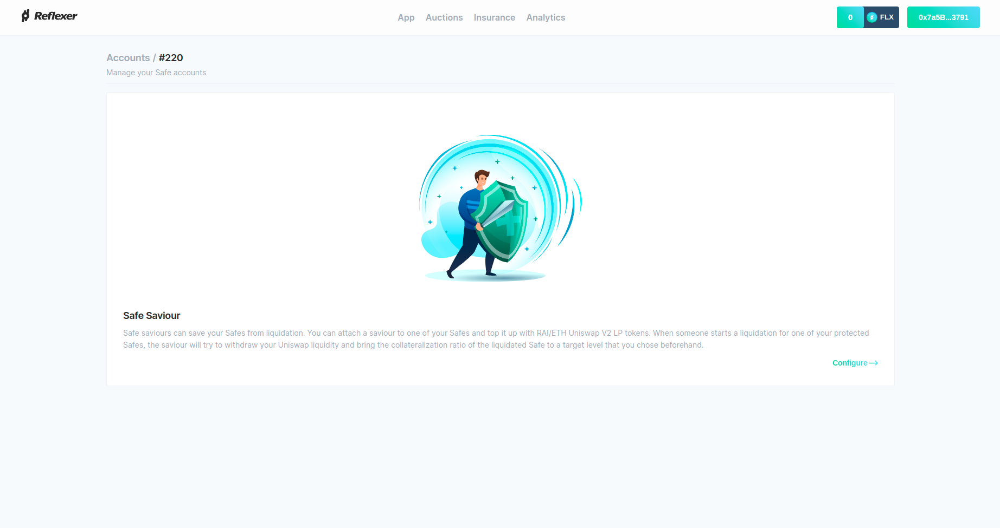
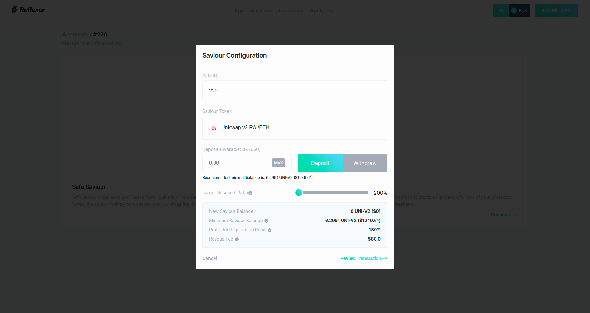
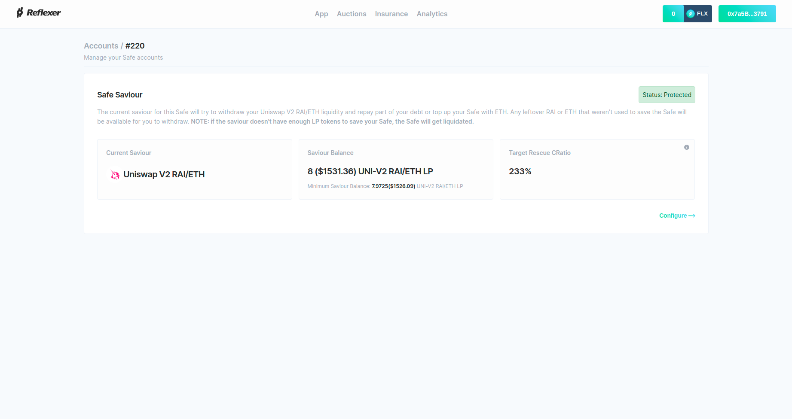
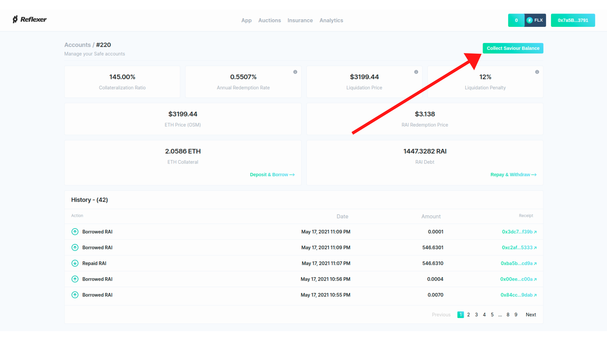

# Liquidation Protection Guide

## 1. What is Liquidation Protection? Why Should I Use It?

Liquidation Protection is a unique feature that \(as of the date of this guide\) no other DeFi protocol has besides RAI. It forces liquidators to try and save your RAI SAFEs before they are liquidated. This is especially useful during a sharp price drop \(e.g Black Thursday from March 2020\) when gas prices explode and no one, not even you, can save your capital.

There are two key advantages in protecting your SAFE:

* Capital efficiency - protecting your SAFE means that you can mint more RAI with the same amount of ETH and have a higher guarantee that your capital will stay safe
* Peace of mind - an extra layer of cover for your SAFE means you can sleep better knowing that your capital is in a safer place

## 2. Walkthrough to Protect a SAFE

In order to protect a SAFE, you first need to create one using the [Reflexer official app](https://app.reflexer.finance/).

Then, you need to go to the detail page of your SAFE by clicking on **Manage Safe**:

Your SAFE can be protected from liquidation by what we call a "saviour". A saviour is a smart contract that watches over SAFEs. When someone starts to liquidate a SAFE that's watched by a saviour, the saviour will first try to increase the SAFE's collateralization ratio by adding more ETH in it or repaying some of its debt.

To start connecting a saviour to your SAFE, you can click on **Add a Saviour** which is on every SAFE's details page:

You should see the onboarding page for saviours:

Once you click on **Configure**, you should see the configuration screen:

You will notice a couple of things:

* You can deposit LP tokens in a saviour that protects your SAFE. During a liquidation, the saviour will first try to pull your liquidity from a DEX \(in this case, Uniswap v2\) and repay some of your debt or add more ETH in the SAFE
* There is a Target Rescue CRatio. This is the collateralization ratio that your SAFE will have in case it is successfully saved. If the saviour cannot bring the SAFE's collateralization ratio to the target that you specify, it will not save the SAFE at all \(the SAFE will end up getting liquidated\)
* The Protected Liquidation Point is the minimum collateralization ratio at which your SAFE can get liquidated and the saviour still manages to save it. If the SAFE gets liquidated below this threshold, these is a high chance it will not be saved
* There is a Rescue Fee. This is a flat fee that has to be paid to the address that initially wanted to liquidate your SAFE but ended up saving it. The saviour must both pay this fee and manage to bring the CRatio of your SAFE to the Target Rescue CRatio that you picked, otherwise your SAFE will end up getting liquidated. The Rescue Fee can be changed by governance

Once you pick an amount of tokens to deposit in the saviour and a Target Rescue CRatio, you can click on **Review Transaction** and then on **Confirm Transaction**. After your transaction is confirmed, you should see a screen like this:

Congrats, your SAFE is now being protected! 🎉

Let's see what happens after one of your SAFEs gets saved. If you go to the SAFE details page, you'll see a button called **Collect Saviour Balance**:

Sometimes, the saviour doesn't need to use all the tokens you deposited in order to save your SAFE. You can collect these unused tokens \(e.g ETH & RAI withdrawn from Uniswap\) by clicking on **Collect Saviour Balance**.

## 3. Best Practices

* Avoid minting more RAI after you protect your SAFE. If you do mint more after you protect it \(regardless of whether you add more ETH or not\), try to add more LP tokens in the saviour to make sure your SAFE can still be saved now that it has more debt
* Liquidation Protection is **not** a completely set and forget system. You should still watch your SAFE. The idea for protection is that it makes RAI more capital efficient \(you can mint more RAI with the same amount of ETH\) and liquidators are forced to try and save your SAFEs before they liquidate you
* You should deposit more LP tokens than the minimum recommended amount \(which can be found in the app when you deposit cover for a SAFE\). By depositing more tokens than the minimum, you take into account the fact that your SAFE accrues debt over time \(because of the interest rate\), meaning that you will slowly need more and more tokens to save it 

## 4. Gotchas

* If the saviour you're using cannot bring the collateralization ratio of a protected SAFE to the **Target Rescue CRatio** you picked, the saviour will not save the SAFE at all
* When a saviour saves a SAFE, it will withdraw all your liquidity from a DEX using the LP tokens you deposited. If you want your SAFE to be protected after it's saved, you need to deposit tokens again in the saviour
* You must have enough tokens deposited in the saviour so that it can both save your SAFE and also reimburse the liquidator that ended up paying for the save action
* Once a SAFE is saved, there are probably leftover tokens that were withdrawn from Uniswap and not used for anything. You can redeem these extra tokens at any time by going back to the SAFE's details page and clicking on **Collect Saviour Balance**

## 5. Why Use Liquidation Protection Instead of DeFi Saver?

Liquidation Protection is not meant to replace platforms such as DeFi Saver. Rather, it is meant as an extra cover layer for your SAFEs in cases where not even DeFi Saver might be able to protect you \(e.g network congestion during sharp ETH price drops when few people can get a transaction through\).

